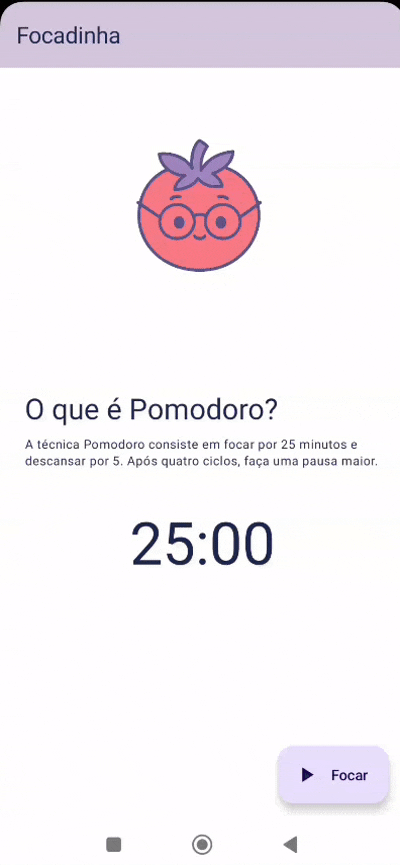

# Focadinha

Um app simples de Pomodoro criado como exercício de aprendizado em Kotlin + Jetpack Compose.  
Mesmo sendo um projeto de estudo, foi feito com muito cuidado, atenção e um toque de fofura.

## Tecnologias utilizadas

- Kotlin
- Jetpack Compose
- Android Studio
- Arquitetura simples com separação de camadas (view/controller/repository)
- Imagens e design com paleta personalizada

  

---

Desenvolvido com carinho por [@ibiaalice](https://github.com/ibiaalice)
